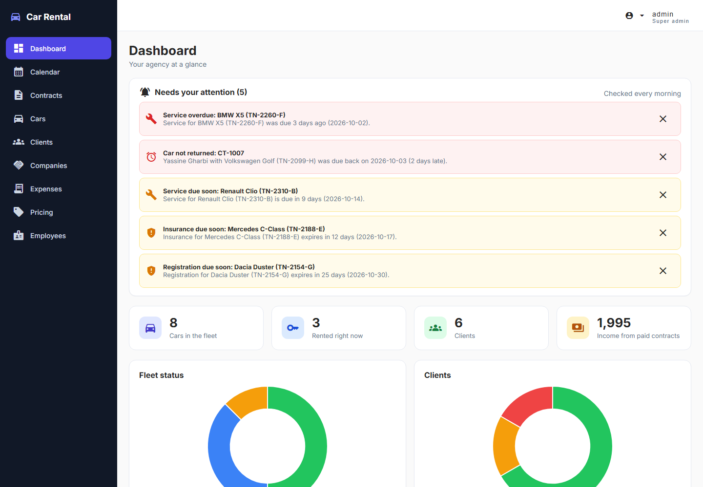
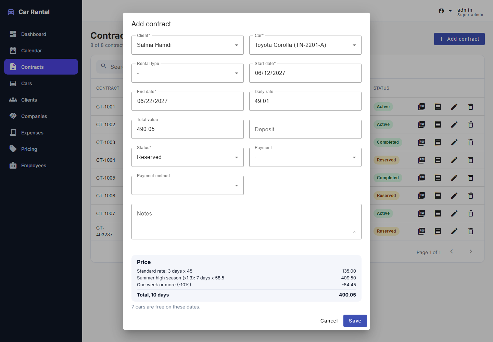
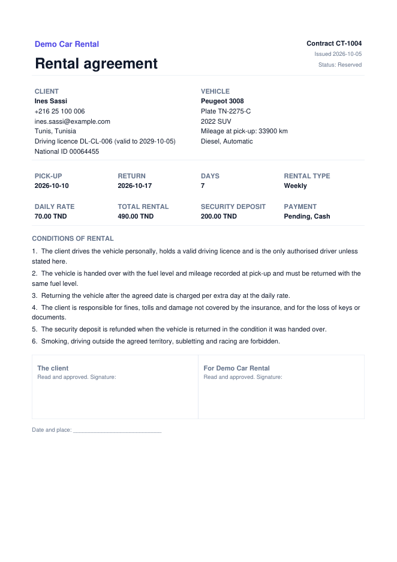
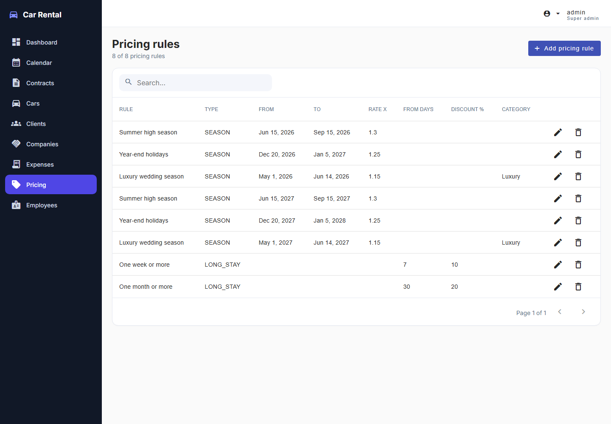
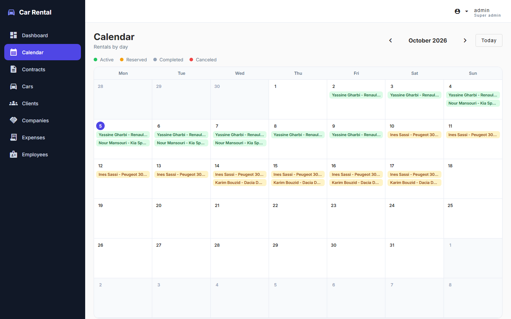
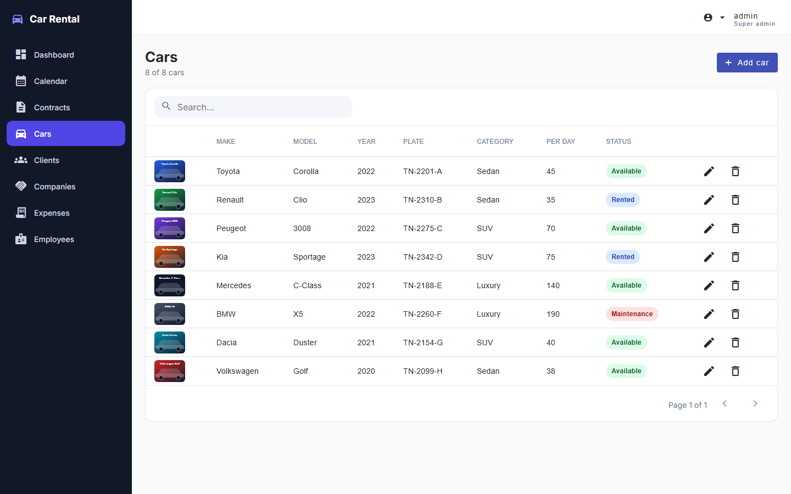
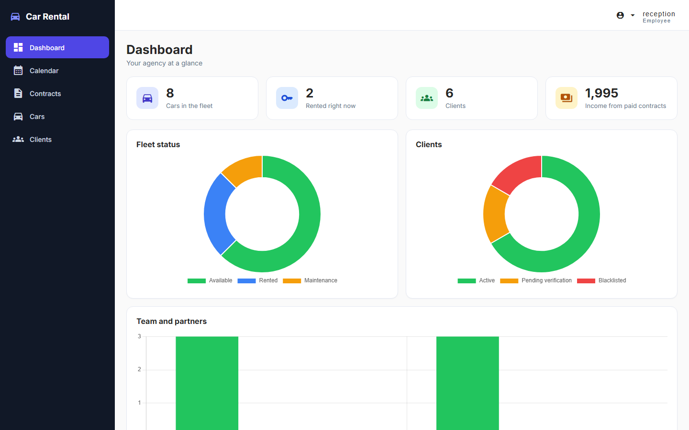
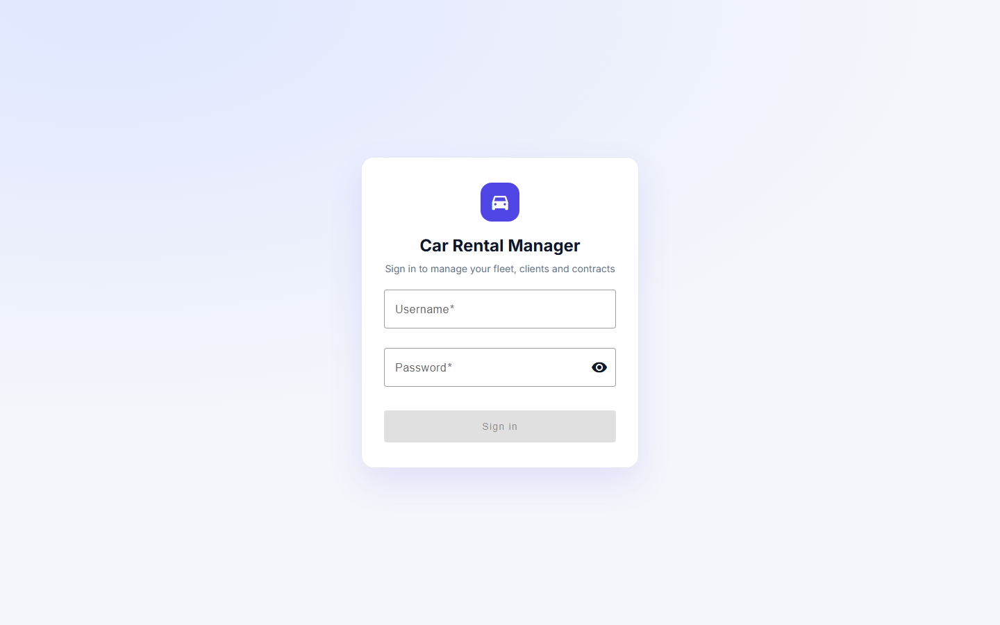

# Car Rental Manager

A back office for a car-rental agency: the fleet, clients, rental contracts with a calendar, expenses, partner companies and staff, with a dashboard and **per-employee access rights**. A manager decides which sections each employee can open; the API enforces it, not just the menu.

**Spring Boot 3 · Java 21 · MySQL · JWT (access + refresh) · Angular 18 · Angular Material · Docker**

| Dashboard with the daily alerts | A contract priced by the rules (season, long stay) |
| --- | --- |
|  |  |

| Printable rental agreement (PDF) | Pricing rules |
| --- | --- |
|  |  |

| Rental calendar | Cars |
| --- | --- |
|  |  |

| An employee sees only what they were given | Sign in |
| --- | --- |
|  |  |

## What it does

- **Fleet**: cars with picture, category, rates (day, week, month), status, mileage, insurance and registration dates.
- **Clients**: contact details, driving licence, emergency contact, status (active, pending verification, blacklisted).
- **Contracts and calendar**: pick a client and the dates, and the form offers only the cars that are free on those days. The price is computed by the pricing rules and explained line by line. Every rental appears on a month calendar.
- **No double bookings.** Booking a car that is already reserved for any of those days is refused with a message naming the clashing contract. This holds when two people book at the same moment: the car's row is locked while the check and the save happen (a test fires 8 simultaneous requests for one car and exactly one wins). A car returned on the 10th can be rented again on the 10th.
- **Printable PDFs**: one click on a contract gives the rental agreement (client, vehicle, dates, price, conditions, signature boxes) or the invoice.
- **Seasonal pricing**: administrators define *seasons* (for example summer x1.3, optionally only for one car category) and *long-stay discounts* (7 days or more: 10 percent off). The quote shows each stretch of the rental at its rate and the discount. When seasons overlap, the one that moves the price most wins.
- **Daily alerts**: every morning (and at start-up) the app checks the fleet and contracts and lists, on the dashboard, insurance or registration expiring within 30 days, services due within 14 days, and rentals that are past their return date or due back today. Alerts clear themselves when the cause is fixed, and a dismissed alert stays dismissed.
- **Expenses and companies** (insurers, garages, tour operators), and **employees** with a salary, a department and an access-rights record.
- **Roles**: super admin and agency admin see everything; an *employee* only gets the sections ticked on their record (dashboard, cars, clients, contracts, payments, companies, expenses, reports). An admin can create or reset an employee's login from the Employees screen.

## Run it

Needs Docker with Compose.

```bash
docker compose up --build
```

| Service | URL |
| --- | --- |
| Web app | http://localhost:4200 |
| API | http://localhost:8080/api (docs at `/swagger-ui.html`) |

The first start creates the administrator and a demo agency (8 cars, 6 clients, 7 contracts, expenses, 3 partner companies, 3 staff members, pricing rules, and a few cars with documents about to expire so the alerts have something to show). Every port is bound to `127.0.0.1` and the database is not published.

| Role | Username | Password |
| --- | --- | --- |
| Super admin | `admin` | `Admin@2026!` (the `ADMIN_PASSWORD` in `.env`) |
| Agency manager (admin) | `manager` | `Rental@2026!` |
| Accountant (dashboard, contracts, payments, expenses, reports) | `accountant` | `Rental@2026!` |
| Receptionist (dashboard, cars, clients, contracts) | `reception` | `Rental@2026!` |

Try this: sign in as `reception`; the menu has no Expenses or Employees, and opening `/expenses` sends you back to the dashboard. Then ask the API directly: `GET /api/expenses` with that token answers 403.

## Security

I audited this project by running it and attacking it. The original state, and what changed:

- **The whole API was open.** The security config ended with `anyRequest().permitAll()` and no endpoint had any rule, so anyone could read or change cars, clients (personal data), contracts and expenses. There was also no way to create an administrator at all, which is probably why. Now the API is deny-by-default, and each section checks the caller's role and, for employees, their stored access rights.
- **Tokens of the wrong kind worked as access tokens.** A refresh token, or the password-reset token that is e-mailed to a user, opened the API. Only an access token does now.
- **Open self-registration** created accounts that could do nothing useful; it is removed. Staff accounts are created by an administrator.
- **Client-supplied ids overwrote records** on create; the database decides ids now.
- **Client mistakes answered 500** (bad id, malformed JSON, wrong content type). They are 400, 415 and 404 with one JSON error shape, and nothing internal leaks.
- **Secrets and unused code.** A mail password and a database password had been committed, the JWT secret had a public default, and a MongoDB telemetry service, web push and a WebSocket config sat unused and unreferenced by the UI. They are removed; configuration comes only from environment variables, and the API refuses to start with a missing or too-short `JWT_SECRET` (or the development key in production).
- **The web app is rebuilt.** The previous front end was a vendor template: its login was a Firebase demo login with pre-filled template credentials, nothing sent a token to the API, and several pages (clients, calendar) never called it. It is now a lean Angular app with real JWT sign-in and refresh, route guards by section, and every screen wired to the API.
- **Real bugs fixed along the way:** the car list could not be serialized (a lazy collection with `open-in-view` off), pictures could not be saved (a 255-character column for data URLs), and the login crashed on a plain-text JWT key.

## Tests

```bash
cd backend && mvn test
```

22 integration tests start the whole API on an in-memory database and call it over real HTTP.

- Access (12): login required everywhere, administrators, the receptionist and accountant limits (read and write), the menu endpoint, refresh and reset tokens refused as access tokens, no public registration, tidy login failures, ids never overwritten, employee login creation, 4xx for client mistakes and the JWT key guard.
- Bookings and features (10): overlaps refused in every shape (inside, around, across an edge), back-to-back allowed, canceled contracts hold nothing, editing a booking, the 8-requests-at-once race, availability, season and long-stay arithmetic (including a season that starts mid-rental), who may edit pricing rules, PDF content and permissions, and the alerts (flagged, dismissed, cleared, new ones appearing).

Each protection was checked by removing it and watching tests fail; without the car row lock the race test books the car twice. CI also builds the web app and validates the compose file.

## Configuration

Copy `.env.example` to `.env`; every value is optional locally.

| Variable | Purpose |
| --- | --- |
| `JWT_SECRET` | signs tokens, at least 32 characters; required, the dev default is refused in production |
| `DB_URL`, `DB_USERNAME`, `DB_PASSWORD` | database (compose fills these in) |
| `ADMIN_USERNAME`, `ADMIN_PASSWORD` | the first administrator, created while no user exists |
| `DEMO_DATA`, `DEMO_PASSWORD` | seed the demo agency and its staff logins |
| `CORS_ALLOWED_ORIGINS`, `WEB_URL` | the web app's origin and public address |
| `SMTP_USERNAME`, `SMTP_PASSWORD` | optional, for password-reset e-mails |
| `AGENCY_NAME`, `AGENCY_CURRENCY` | printed on the contract and invoice PDFs (default `Demo Car Rental`, `TND`) |
| `ALERTS_CRON` | when the daily alert check runs (default `0 0 6 * * *`) |

## Deploying (free tiers, works with a private repository)

| Part | Where | How |
| --- | --- | --- |
| Database | TiDB Cloud Serverless | create a database named `carrental` |
| API | Render (Docker) | New, Blueprint, pick this repo: `render.yaml` does the rest; set `DB_URL`, `DB_USERNAME`, `DB_PASSWORD`, `ADMIN_PASSWORD` |
| Web app | Vercel | import the repo, Root Directory `frontend`; `frontend/vercel.json` forwards `/api` to the API, so the browser only talks to one origin |

The free API sleeps when idle: the first request after a pause can take about a minute.

## Project layout

```
backend/    Spring Boot API: controller / service / repository / model, security (JWT, permissions), tests
frontend/   Angular 18 app: sign-in, dashboard, calendar and one config-driven screen for each resource
docs/       screenshots
```
