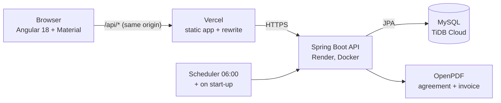

# Car Rental Manager

A back office for a car-rental agency: the fleet, clients, rental contracts on a calendar, pricing rules, expenses, partner companies and staff. The manager decides which sections each employee may open (a receptionist can write contracts but never see expenses), and the **API enforces it**, not just the menu. Two people booking the same car for the same days cannot both succeed.

**Spring Boot 3.5 · Java 21 · MySQL · JWT (access + refresh) · Angular 18 · Angular Material · Docker**

**Live demo:** https://carrental-platform.vercel.app — sign in as `manager` or `reception`, password `Rental@2026!`. The free API sleeps when idle: the login page wakes it and waits (up to a few minutes) with a "Waking up the free demo server" note. Demo data only.

| Dashboard with the daily alerts | A contract priced by the rules (season, long stay) |
| --- | --- |
|  |  |

| Printable rental agreement (PDF) | Rental calendar |
| --- | --- |
|  |  |

| An employee sees only what they were given | Pricing rules |
| --- | --- |
|  |  |

## Architecture



Locally, `docker compose up` runs the same three parts (MySQL, API, web app served by nginx) with every port bound to `127.0.0.1`.

**Request path.** Every call carries a short-lived access JWT (8 h). A filter accepts only tokens whose `type` claim is `access`; refresh tokens (7 days) and password-reset tokens are refused there. The web app's interceptor refreshes an expired token once and replays the call.

**Authorization, in one place.** Security is deny-by-default: only login, refresh, password reset and the API docs are public. Each controller method then names the section it belongs to, for example `@PreAuthorize("@perm.can('contracts')")`. `PermissionService` (the `@perm` bean) answers from the caller's role and, for employees, from their stored `AccessRights` row, re-read on every request. Writing needs `can(section)`; reading cars and clients is also allowed to whoever may write contracts, because the contract form needs them (`canRead`). Pricing rules and employees are admin-only. The Angular route guards mirror the same rights from `GET /api/auth/me`, but they only shape the menu: the API never trusts them.

**Booking a car** (`ContractServiceImpl.save`), in one transaction:
1. lock the car row (`SELECT … FOR UPDATE` through `CarRepository.lockByLicensePlate`),
2. look for a `Reserved` or `Active` contract on that car overlapping the nights `[start, end)`,
3. refuse with **409** naming the clashing contract, or save.

A second booking of the same car waits at step 1 until the first commits, then sees it at step 2. Nights are half-open, so a car returned on the 10th can leave again on the 10th. `GET /api/availability/cars` runs the same overlap query for all cars so the form only offers free ones (cars in maintenance are hidden).

**Pricing** (`pricing/`). A rule is either a `SEASON` (date range, multiplier, optionally one car category) or a `LONG_STAY` discount (minimum days, percent). `GET /api/pricing/quote` prices night by night; when seasons overlap, the one that moves the price furthest from the normal rate wins; the best long-stay discount then applies to the total. The quote returns its line items, so the screen can explain the price.

**Alerts** (`alerts/`). A scheduled job (06:00 by default, and once at start-up) recomputes what needs attention: insurance or registration expiring within 30 days, service due within 14, rentals due back today or overdue. Each alert has a deterministic key (type + car + due date), so a re-run updates instead of duplicating, an alert disappears when its cause is fixed, and a dismissed alert stays dismissed.

**PDFs** (`document/ContractDocumentService`). `GET /api/contracts/{id}/pdf?type=contract|invoice` renders the agreement or the invoice with OpenPDF, using the agency name and currency from the configuration.

**Web app** (`frontend/`). A small Angular 18 app: login, dashboard, calendar, and **one config-driven CRUD screen** (`resources.ts` + `resource-dialogs.component.ts`) that renders cars, clients, contracts, expenses, companies, employees and pricing rules from a description of their fields.

## Key decisions and trade-offs

1. **A database row lock, not an application lock, against double booking.**
   *Why:* the check and the save must be atomic across several API instances; the database is the only shared arbiter. *Cost:* bookings of the *same car* are serialized (harmless at agency scale; different cars don't wait). *Alternatives:* a unique constraint cannot express "date ranges overlap" in MySQL; a Java lock or `synchronized` breaks as soon as there are two instances; optimistic versioning on the car would work but turns every clash into a retry.
2. **Permissions are data, checked by the API on every call.**
   *Why:* the manager changes an employee's rights from the Employees screen without a deploy, and a hand-written request gets the same answer as the menu. *Cost:* one extra lookup per request. *Alternative:* rights baked into the JWT would save the lookup but stay valid until the token expires after a change.
3. **Rebuild the front end instead of fixing the template.**
   *Why:* the original was a vendor template with a fake Firebase login that sent no token and pages that never called the API. A lean app with real sign-in and one configurable CRUD screen was smaller than fixing it, and every screen is now honest. *Cost:* less visual polish than the template.
4. **Alerts are stored, not computed on each page load.**
   *Why:* storing them is what lets a dismissal stick and lets the job run on a schedule. *Cost:* an alert can be up to a day old between runs (the job also runs on start-up).
5. **One origin through a Vercel rewrite.**
   *Why:* the browser only talks to `carrental-platform.vercel.app`, so the deployed app needs no CORS setup and no API URL baked into the build. *Cost:* while the free API is asleep the proxy answers 502; the login page treats 0/502/503/504 as "still waking up" and retries for about 3.5 minutes.
6. **Password-reset tokens are tied to the current password hash.**
   *Why:* the token carries a fingerprint of the hash, so it stops working as soon as the password changes: single use without a token table. *Cost:* none worth noting at this size.

## Security model

| Who | Can do |
| --- | --- |
| Super admin, agency admin | everything, including employees, their logins and pricing rules |
| Employee | only the sections ticked on their record; reading cars and clients comes with the contracts right |
| Anyone else | login, refresh, password reset, API docs |

- **Deny-by-default** with method-level checks on every controller; unauthenticated → 401, not allowed → 403, both as JSON.
- **No self-registration.** Staff logins are created by an administrator from the Employees screen.
- **Ids come from the database:** a client-supplied id on create is ignored, so a request cannot overwrite an existing record.
- **Configuration only from the environment.** The API refuses to start with a missing or short (< 32 bytes) `JWT_SECRET`, or with the development key under the `prod` profile.
- **Client mistakes are 4xx** (400 / 404 / 409 / 415) in one JSON shape; nothing internal leaks.

**What the audit found and fixed.** I audited the original project by running and attacking it: the whole API was open (`anyRequest().permitAll()`), refresh and e-mailed reset tokens worked as access tokens, open self-registration existed, client ids overwrote records, client mistakes answered 500, a mail password and a database password were committed and the JWT secret had a public default. Unused code (a MongoDB telemetry service, web push, an unused WebSocket config) was removed. Runtime bugs fixed along the way: the car list could not be serialized (lazy collection with `open-in-view` off), pictures could not be saved (a 255-character column for data URLs), and login crashed on a plain-text JWT key.

**Known trade-offs.** Tokens live in `localStorage` (simple, but readable by any script injected into the page; the app renders no user HTML). There is no rate limit on login.

## Features

- **Fleet**: cars with picture, category, day/week/month rates, status, mileage, insurance, registration and service dates.
- **Clients**: contact details, driving licence, emergency contact, status (active, pending verification, blacklisted).
- **Contracts and calendar**: pick a client and dates, the form offers only free cars, the price is computed by the rules and explained line by line; every rental shows on a month calendar.
- **Pricing rules**: seasons (for example summer ×1.3, optionally one category) and long-stay discounts (7 days or more: 10 % off).
- **PDFs**: rental agreement and invoice for any contract.
- **Daily alerts** on the dashboard, with dismiss.
- **Expenses, partner companies** (insurers, garages, tour operators) and **employees** with a salary, department and access rights.

## Run it

Needs Docker with Compose.

```bash
docker compose up --build
```

| Service | URL |
| --- | --- |
| Web app | http://localhost:4200 |
| API | http://localhost:8080/api (docs at `/swagger-ui.html`) |

The first start creates the administrator and a demo agency: 8 cars, 6 clients, 7 contracts, 6 expenses, 3 partner companies, 3 staff members, pricing rules, and a few cars with documents about to expire so the alerts have something to show.

| Role | Username | Password |
| --- | --- | --- |
| Super admin | `admin` | `Admin@2026!` (the `ADMIN_PASSWORD` in `.env`) |
| Agency manager (admin) | `manager` | `Rental@2026!` |
| Accountant (dashboard, contracts, payments, expenses, reports) | `accountant` | `Rental@2026!` |
| Receptionist (dashboard, cars, clients, contracts) | `reception` | `Rental@2026!` |

Try this: sign in as `reception`; the menu has no Expenses or Employees, and opening `/expenses` sends you back to the dashboard. Then ask the API directly: `GET /api/expenses` with that token answers 403.

## Tests

```bash
cd backend && mvn test
```

22 integration tests start the whole API on an in-memory database (H2 in MySQL mode) and call it over real HTTP.

- **Access control (12)** prove that every endpoint needs a login, that the receptionist and accountant get exactly their sections (read and write), that the menu endpoint matches the rights, that refresh and reset tokens are refused as access tokens, that there is no public registration, that a create never overwrites an existing record, that an admin can create an employee login, that client mistakes are 4xx, and that short or development JWT keys are refused.
- **Bookings and features (10)** prove that overlaps are refused in every shape (inside, around, across an edge) while back-to-back bookings and canceled contracts are fine, that **8 simultaneous requests for one car produce exactly one booking**, the availability list, the season and long-stay arithmetic (including a season starting mid-rental), who may edit pricing rules, the PDF content and permissions, and the alert life cycle (flagged, dismissed, cleared, new ones appearing).

Each protection was checked by removing it and watching its test fail; without the row lock the race test books the car twice. CI runs the tests, builds the web app and validates the compose file.

## Configuration

Copy `.env.example` to `.env`; every value is optional locally.

| Variable | Purpose |
| --- | --- |
| `JWT_SECRET` | signs tokens, at least 32 characters; the dev default is refused in production |
| `DB_URL`, `DB_USERNAME`, `DB_PASSWORD` | database (compose fills these in) |
| `ADMIN_USERNAME`, `ADMIN_PASSWORD` | the first administrator, created while no user exists |
| `DEMO_DATA`, `DEMO_PASSWORD` | seed the demo agency and its staff logins |
| `CORS_ALLOWED_ORIGINS`, `WEB_URL` | the web app's origin and public address (used in reset e-mails) |
| `SMTP_USERNAME`, `SMTP_PASSWORD` | optional, for password-reset e-mails |
| `AGENCY_NAME`, `AGENCY_CURRENCY` | printed on the PDFs (default `Demo Car Rental`, `TND`) |
| `ALERTS_CRON` | when the daily alert check runs (default `0 0 6 * * *`) |

## Deploying (free tiers, works with a private repository)

| Part | Where | How |
| --- | --- | --- |
| Database | TiDB Cloud Serverless | create a database named `carrental` |
| API | Render (Docker) | New, Blueprint, pick this repo: `render.yaml` does the rest; set `DB_URL`, `DB_USERNAME`, `DB_PASSWORD`, `ADMIN_PASSWORD` |
| Web app | Vercel | import the repo, Root Directory `frontend`; `frontend/vercel.json` forwards `/api` to the API |

## Known limits

- The free API sleeps after about 15 minutes idle; the first request after a pause can take from 20 seconds to a few minutes.
- The **payments** and **reports** access rights can be ticked on an employee but no screen or endpoint uses them yet; a contract's payment status (paid, partial, pending) is a field on the contract.
- Contract dates are stored as ISO text (`yyyy-MM-dd`, kept from the original schema); they are validated on save and compare correctly as text, but a real `DATE` column would be cleaner.
- The schema is managed by Hibernate (`ddl-auto=update`), not by migrations.
- The web app has no unit tests; CI builds it and the API tests cover the rules.

## Project layout

```
backend/    Spring Boot API: controller / service / repository / model, security (JWT, permissions),
            pricing/, alerts/, document/ (PDFs), integration tests
frontend/   Angular 18 app: sign-in, dashboard, calendar and one config-driven screen for each resource
docs/       screenshots
```
